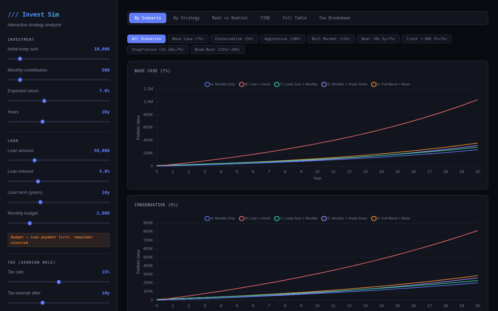
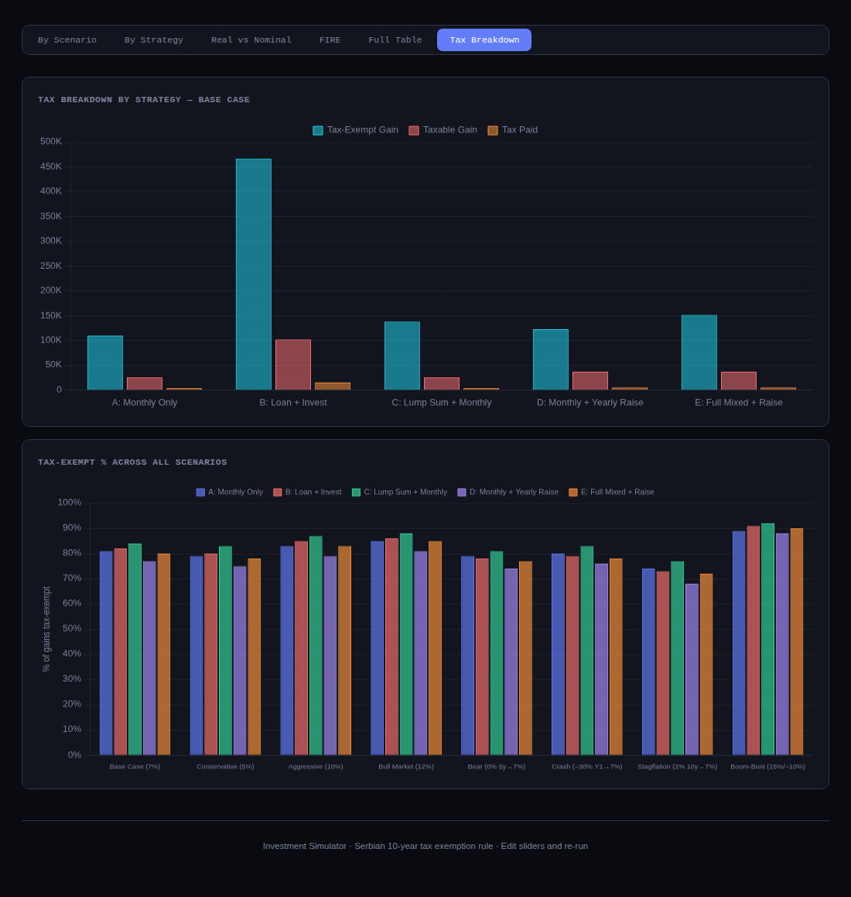
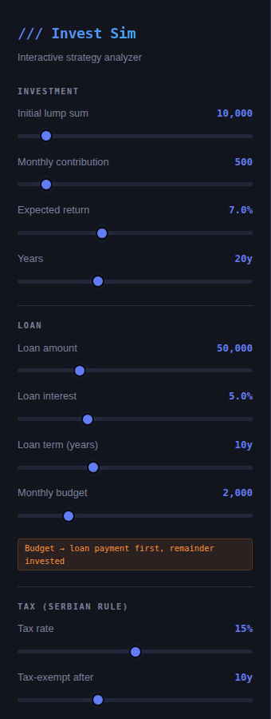
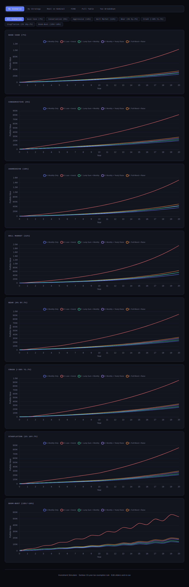
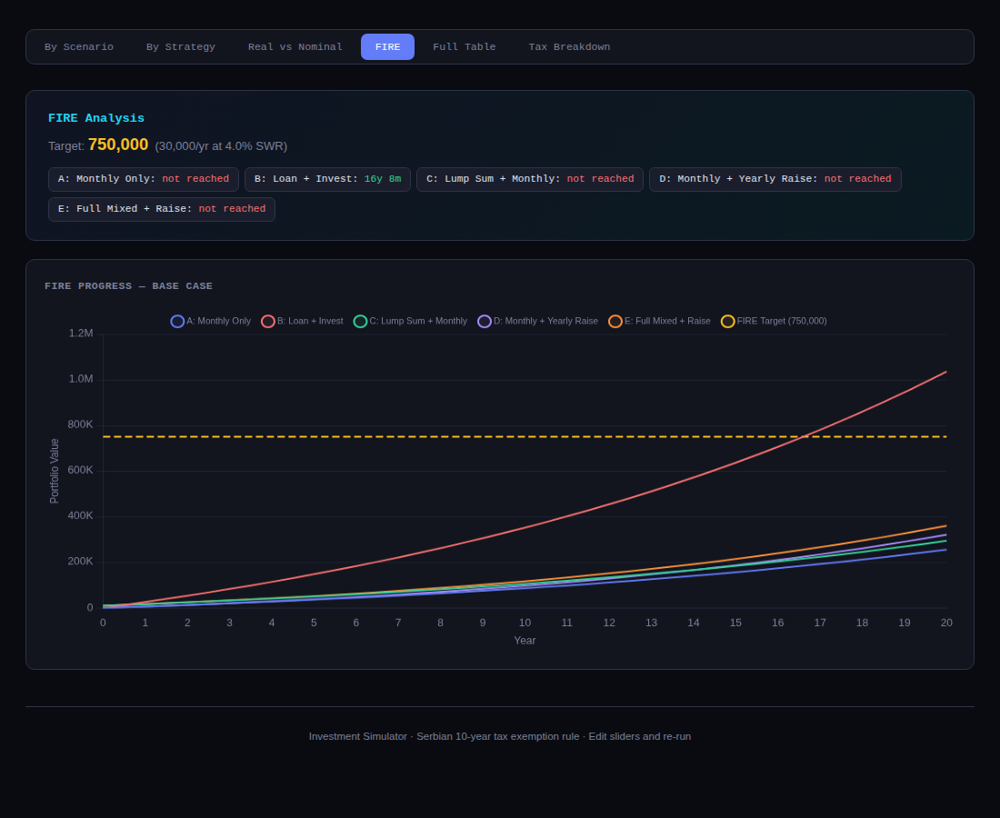
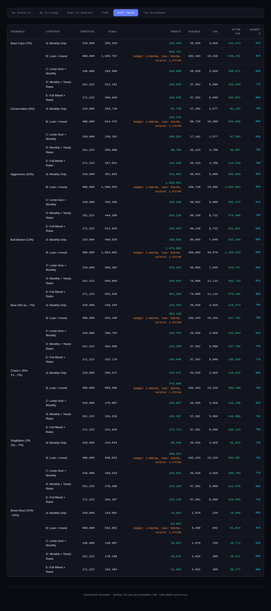

# /// Investment Strategy Simulator

An interactive investment simulation tool that compares different investing strategies across market scenarios — with Serbian capital gains tax rules built in.

Run `node main.js` to get a terminal summary + a fully interactive HTML dashboard you open in your browser. Every parameter is adjustable via sliders with live re-calculation.



---

## Quick Start

```bash
# No dependencies needed — just Node.js
node main.js
```

This does two things:

1. Prints a detailed comparison table to your terminal
2. Generates `output/dashboard.html` — open it in any browser

The dashboard is a single self-contained HTML file (loads Chart.js from CDN). No server, no build step.

---

## What It Simulates

The tool runs **5 investment strategies** across **8 market scenarios** and compares them side by side.

### Strategies

| Strategy                      | Description                                                                                         |
| ----------------------------- | --------------------------------------------------------------------------------------------------- |
| **A: Monthly Only**           | Invest a fixed amount every month                                                                   |
| **B: Loan + Invest**          | Borrow a lump sum, invest it immediately, pay the loan from your monthly budget, invest the surplus |
| **C: Lump Sum + Monthly**     | Invest a lump sum at the start + monthly contributions                                              |
| **D: Monthly + Yearly Raise** | Monthly investing with annual contribution increases                                                |
| **E: Full Mixed + Raise**     | Lump sum + monthly contributions + yearly raises                                                    |

### How the Loan Strategy Works

This is the most interesting one. Say you set:

- Loan: 50,000 at 5% over 10 years → monthly payment ≈ 528
- Monthly budget: 2,000

Each month during the loan (years 1–10):

- 528 goes to loan repayment
- 1,472 gets invested alongside the 50K lump sum

After year 10 (loan paid off):

- Full 2,000 goes to investing

The chart shows your **net position** (portfolio value minus remaining debt), so it starts near zero and climbs as your portfolio grows and debt shrinks.

### Scenarios

| Scenario     | Returns                  |
| ------------ | ------------------------ |
| Base Case    | 7% annually              |
| Conservative | 5% annually              |
| Aggressive   | 10% annually             |
| Bull Market  | 12% annually             |
| Bear Market  | 0% for 5 years, then 7%  |
| Crash        | −30% year 1, then 7%     |
| Stagflation  | 2% for 10 years, then 7% |
| Boom-Bust    | Alternating 15% / −10%   |

---

## Serbian Tax Rules

Serbian capital gains tax has a powerful exemption: **stocks and ETFs held for 10+ years are completely tax-free**. The simulator models this precisely.

For each individual contribution, the tool tracks:

- When it was invested (the month)
- How long it's been held by the end of the simulation
- Whether it qualifies for the 10-year exemption

This means early contributions are tax-free while recent ones get taxed at 15%. The **Tax Breakdown** tab visualizes this per strategy.



The loan strategy benefits heavily from this rule: the 50K lump sum is invested at month 0 and held for the full duration, so a large portion of gains are automatically exempt.

Both the tax rate (default 15%) and the exempt holding period (default 10 years) are adjustable via sliders if the law changes or you want to model other jurisdictions.

---

## Interactive Dashboard

The sidebar has sliders for every parameter. Changes re-run the simulation instantly (with a 200ms debounce). You can also toggle auto-run off and click the **Run Simulation** button manually.



### Dashboard Tabs

**By Scenario** — All 5 strategies overlaid per scenario. Use the filter buttons at the top to focus on one scenario at a time.



**By Strategy** — All 8 scenarios overlaid per strategy. Shows how each approach holds up across different markets.

**Real vs Nominal** — Side-by-side comparison of nominal portfolio values vs inflation-adjusted purchasing power (base case).

**FIRE** — Shows the FIRE target line (annual expenses ÷ withdrawal rate) and tracks which strategies reach it and when.



**Full Table** — Every strategy × scenario combination with invested amount, final value, profit, taxable gain, tax paid, after-tax profit, and exempt percentage.



**Tax Breakdown** — Bar charts showing exempt vs taxable gains per strategy, and exempt percentages across all scenarios.

---

## Configuration

### Interactive (Dashboard)

Just drag the sliders. All parameters update live:

| Slider               | Range           | Default |
| -------------------- | --------------- | ------- |
| Initial lump sum     | 0 – 100,000     | 10,000  |
| Monthly contribution | 0 – 5,000       | 500     |
| Expected return      | 0% – 20%        | 7%      |
| Years                | 5 – 50          | 20      |
| Loan amount          | 0 – 200,000     | 50,000  |
| Loan interest        | 1% – 15%        | 5%      |
| Loan term            | 1 – 30 years    | 10      |
| Monthly budget       | 0 – 10,000      | 2,000   |
| Tax rate             | 0% – 30%        | 15%     |
| Tax-exempt after     | 0 – 30 years    | 10      |
| Inflation            | 0% – 10%        | 3%      |
| Yearly raise         | 0% – 10%        | 3%      |
| FIRE annual expenses | 5,000 – 100,000 | 30,000  |
| FIRE withdrawal rate | 2% – 8%         | 4%      |

### File-Based (config.js)

For the terminal output, edit `config.js`:

```js
module.exports = {
  INITIAL_INVESTMENT: 10_000,
  MONTHLY_INVESTMENT: 500,
  INVESTMENT_GROWTH_RATE: 0.07,
  YEARS: 20,

  LOAN_AMOUNT: 50_000,
  LOAN_INTEREST_RATE: 0.05,
  LOAN_YEARS: 10,
  MONTHLY_BUDGET: 2_000,

  // Serbian rule: 15% tax, exempt after 10 years
  TAX_RATE: 0.15,
  TAX_EXEMPT_YEARS: 10,

  INFLATION_RATE: 0.03,
  YEARLY_INVESTMENT_INCREASE_RATE: 0.03,

  FIRE_ANNUAL_EXPENSES: 30_000,
  FIRE_WITHDRAWAL_RATE: 0.04,

  ENABLE_VOLATILITY: false,
  VOLATILITY_STD: 0.15,
};
```

Then re-run `node main.js`.

---

## Project Structure

```
├── config.js        All parameters (edit this)
├── simulation.js    Pure calculation engine (strategies + tax logic)
├── scenarios.js     Market scenario definitions (add new ones here)
├── main.js          CLI runner + HTML dashboard generator
└── output/
    └── dashboard.html   Interactive dashboard (open in browser)
```

### Adding a New Strategy

In `main.js`, find the `buildStrategies()` function and add an entry:

```js
{
  label: "F: My Custom Strategy",
  fn: simulateMixed,    // or simulateMonthly, simulateLoanInvest, etc.
  params: {
    initial: 20000,
    monthly: 1000,
    years: cfg.YEARS,
    yearlyIncreaseRate: 0.05,
  },
}
```

The same change needs to be made in the interactive strategies array inside `runAll()` further down in the file.

### Adding a New Scenario

In `scenarios.js`, push to the `SCENARIOS` array:

```js
SCENARIOS.push({
  name: "My Scenario",
  annualReturn: 0.08,
  returnsOverride: null, // or an array of per-year returns
});
```

Or use the helper for complex patterns:

```js
const { makeScenario, flatThenGrowth } = require("./scenarios");

// 3% for 7 years, then 9%
SCENARIOS.push(
  makeScenario("Slow Start", 0.09, flatThenGrowth(0.03, 7, 0.09, 20)),
);
```

---

## How the Simulation Works

### Monthly Compounding

Each strategy simulates month-by-month. Annual returns are converted to monthly growth factors:

```
monthly_rate = (1 + annual_rate)^(1/12) - 1
```

At each month: `portfolio = (previous_value + contribution) × (1 + monthly_rate)`

### Loan Amortisation

Standard fixed-payment amortisation. The monthly payment is calculated using:

```
payment = principal × r × (1+r)^n / ((1+r)^n - 1)
```

Where `r` is the monthly interest rate and `n` is total months.

### Serbian Tax Calculation

For each contribution, the engine tracks:

1. The month it was invested
2. The cumulative growth it achieved by simulation end
3. The holding period (total months − investment month)

If holding period ≥ `TAX_EXEMPT_YEARS × 12` → gain is fully exempt.
Otherwise → gain is taxed at `TAX_RATE`.

The total tax is the sum of taxes on all non-exempt contributions.

### Inflation Adjustment

Real values are calculated by deflating nominal values:

```
real_value[m] = nominal_value[m] / (1 + monthly_inflation)^m
```

### FIRE Calculation

FIRE target = annual expenses ÷ withdrawal rate (default: 30,000 ÷ 0.04 = 750,000).

The tool scans the monthly portfolio values to find the first month that exceeds the target.

---

## Volatility Mode

Set `ENABLE_VOLATILITY: true` in `config.js` (or the dashboard code) to add random noise to annual returns using a normal distribution with the configured standard deviation. Each run will produce slightly different results — useful for Monte Carlo-style analysis.

---

## Example: Comparing Loan vs Monthly with Same Budget

A common question: "I have 2,000/month to invest. Should I just invest it all, or borrow 50K, invest the lump sum, and pay the loan from my budget?"

Set both Monthly contribution and Monthly budget to 2,000, then compare:

- **Strategy A** (Monthly Only): invests 2,000/month for 20 years = 480,000 invested
- **Strategy B** (Loan + Invest): borrows 50K, pays 528/month loan + invests 1,472/month for 10 years, then 2,000/month for 10 years = 480,000 total out of pocket

Same total cost, but the loan strategy front-loads capital and benefits from more years of compounding on the initial 50K — plus better tax treatment under Serbian law since that lump sum is held for the full 20 years.

---

## License

MIT — do whatever you want with it.
